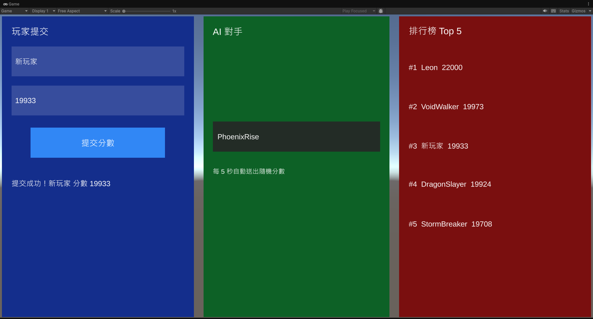

# Game Leaderboard

即時遊戲排行榜 Demo：Go + Redis 後端 + Unity3D 前端。

```
game-leaderboard/         ← 此 repo 根目錄
├── main.go               ┐
├── handler/              │  Go + Gin HTTP Server
├── service/              │
├── repository/           │
├── model/                ┘
├── Dockerfile
├── docker-compose.yml
└── client/               ← Unity3D 前端（Unity 6）
    └── Assets/Scripts/
        ├── PlayerPanel.cs
        ├── OpponentPanel.cs
        └── LeaderboardPanel.cs
```

---

## 後端啟動

**前置需求：** Docker Desktop

```bash
docker-compose up --build
```

此指令會同時啟動：
- **Redis 7**（port `6379`）
- **Go Server**（port `8080`）

API 位址：`http://localhost:8080`

清除所有資料並停止：

```bash
docker-compose down -v
```

---

## Unity 前端設定



**前置需求：** Unity 6（6000.x），已匯入 TextMeshPro Essential Resources

### 1. 開啟專案

用 Unity Hub 開啟 `client/` 資料夾。

### 2. 中文字型（首次設定）

UI 使用微軟正黑體顯示中文，此字型隨 Windows 附帶，無法放入 repo。

請手動複製：

```
C:\Windows\Fonts\msjh.ttc  →  client/Assets/Fonts/msjh.ttc
```

複製完成後，在 Unity Editor 執行 **Tools → Build Leaderboard UI** 重新建立 UI。

### 3. 文字顯示為空白時

Unity 選單：**Window → TextMeshPro → Import TMP Essential Resources**

### 4. 開始執行

確認 `docker-compose up` 已在執行中，再按 Unity 的 **Play**。

---

## 架構

```
Unity Client
     │  HTTP（UnityWebRequest）
     ▼
Gin HTTP Server（:8080）
     │
     ▼
Redis Sorted Set
```

### 為什麼選 Redis Sorted Set？

| 操作 | Redis 指令 | 時間複雜度 |
|---|---|---|
| 提交 / 更新分數 | `ZADD GT` | O(log N) |
| 取得前 N 名 | `ZREVRANGE` | O(log N + M) |
| 查詢玩家排名 | `ZREVRANK` | O(log N) |
| 移除玩家 | `ZREM` | O(log N) |

`ZADD GT` 確保每位玩家只保留最高分，不需要額外的讀取再修改操作。

---

## API 說明

### 提交分數

```bash
curl -X POST http://localhost:8080/api/v1/scores \
  -H "Content-Type: application/json" \
  -d '{"player_id": "alice", "score": 9500}'
```

```json
{"message": "score submitted", "player_id": "alice", "score": 9500}
```

> 只保留最高分，提交較低分數不會有任何效果。

### 取得排行榜（前 N 名）

```bash
curl "http://localhost:8080/api/v1/leaderboard?limit=5"
```

```json
{
  "leaderboard": [
    {"rank": 1, "player_id": "bob",   "score": 12000},
    {"rank": 2, "player_id": "alice", "score": 9500}
  ],
  "total": 2
}
```

### 查詢玩家排名

```bash
curl http://localhost:8080/api/v1/players/alice/rank
```

### 移除玩家

```bash
curl -X DELETE http://localhost:8080/api/v1/players/alice
```

### 健康檢查

```bash
curl http://localhost:8080/health
```

---

## 執行測試

```bash
go test ./... -v
```

---

## 擴展性討論

**目前設計**可在單一 Redis 實例上支援數萬名並發玩家。

**若要支援數百萬玩家：**

1. **Redis Cluster** — 將 Sorted Set 依分數區間或一致性雜湊分片到多個節點。
2. **Read Replica** — 讀取操作（`ZREVRANGE` / `ZREVRANK`）導向 replica，寫入導向 primary。
3. **快取 Top-N** — 在記憶體中快取前 10/100 名（每幾秒刷新），減少 Redis 往返次數。
4. **分頁** — 對超過 1000 筆的排行榜改用 cursor-based pagination。
5. **水平擴展 App** — 無狀態的 Go Service 可在 Load Balancer 後方水平擴展，只有 Redis 是有狀態的。
